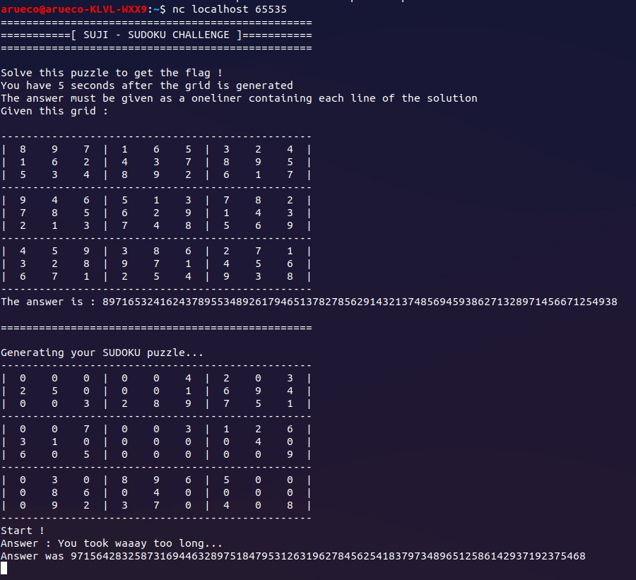
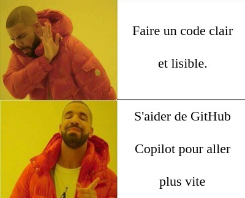
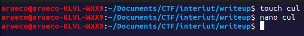
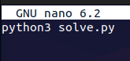
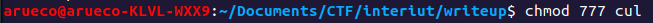
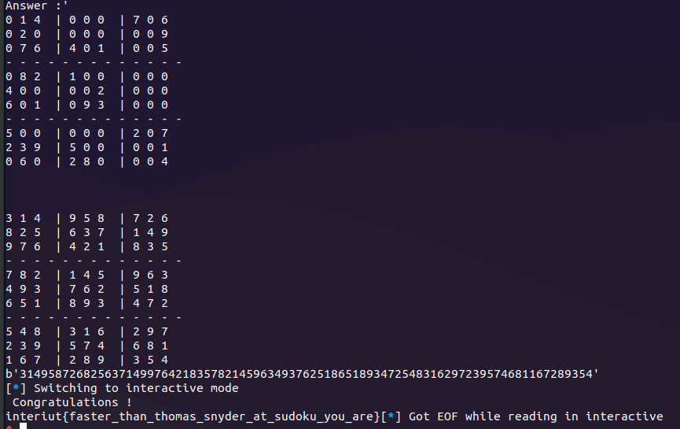

# Challenge Suji

## Consigne
La Matrice vous met au défi ! Pouvez-vous résoudre ce sudoku en moins de 5 secondes ?

## Introduction

Lorsque nous accédons au challenge via ```nc suji.interiut2022 65535``` nous obtenons ce résultat :


Nous comprenons très vite que nous devons parser le second  Sudoku, il s'agit donc de la première étape.

## Parsing
J'ai utilisé pwntool pour me connecter au netcat.

```python
if __name__ == '__main__':  
    p = remote('localhost', 65535)
```

 Avant de commencer le parsing, je me suis renseigné sur les formats attendus par les fonctions python permettant de résoudre des sudokus. Généralement, le format attendu est sous cette forme :
 
```python
[[],[],[],[],[],[],[],[],[]]
```
Chaque liste représente une ligne de sudoku, exemple :
```
-------------------------------------------------
|  6    8    2  |  0    0    0  |  0    0    9  |
|  0    0    0  |  0    9    0  |  2    5    0  |
|  0    0    5  |  0    0    1  |  7    8    6  |
-------------------------------------------------
|  0    0    0  |  0    0    0  |  8    6    7  |
|  7    1    0  |  0    6    4  |  0    0    5  |
|  5    0    6  |  7    8    0  |  0    0    0  |
-------------------------------------------------
|  8    0    4  |  0    2    7  |  6    1    3  |
|  1    0    7  |  0    0    6  |  0    0    0  |
|  2    0    9  |  5    1    0  |  4    0    0  |
-------------------------------------------------

grid = [[6, 8, 2, 0, 0, 0, 0, 0, 9],
	[0, 0, 0, 0, 9, 0, 2, 5, 0], 
	[0, 0, 5, 0, 0, 1, 7, 8, 6], 
	[0, 0, 0, 0, 0, 0, 8, 6, 7], 
	[7, 1, 0, 0, 6, 4, 0, 0, 5], 
	[5, 0, 6, 7, 8, 0, 0, 0, 0], 
	[8, 0, 4, 0, 2, 7, 6, 1, 3], 
	[1, 0, 7, 0, 0, 6, 0, 0, 0], 
	[2, 0, 9, 5, 1, 0, 4, 0, 0]]
```
J'ai donc chercher à obtenir une liste sous cette forme.

1) Récupération des grilles de sudoku :
 ```python
recv = str(p.recvuntil('Answer :'))  
sudoku = recv.split('\\n')  
lines = []  
for i in range (len(sudoku)):  
    if sudoku[i] != '':  
        if sudoku[i][0] == '|' :  
  
            lines.append(sudoku[i])
```
2) Récupération du Sudoku qui nous intéresse, le deuxième :
```python
matrix1 =lines[9:12]  
matrix2 =lines[12:15]  
matrix3 =lines[15:18]
```
3) Représenter chaque carré dans une liste (de base je voulais représenter la grille finale avec des carrés)



```python
square1 = []  
square2 = []  
square3 = []  
square4 = []  
square5 = []  
square6 = []  
square7 = []  
square8 = []  
square9 = []  
  
for i in range(len(matrix1)):  
    square1.append(matrix1[i][2:14])  
    square2.append(matrix1[i][18:30])  
    square3.append(matrix1[i][34:46])  
  
for i in range(len(matrix2)):  
    square4.append(matrix2[i][2:14])  
    square5.append(matrix2[i][18:30])  
    square6.append(matrix2[i][34:46])  
  
for i in range(len(matrix3)):  
    square7.append(matrix3[i][2:14])  
    square8.append(matrix3[i][18:30])  
    square9.append(matrix3[i][34:46])
```
4) Rendre ces listes "propres" en virant les espaces ainsi qu'en les convertissant en int et les ajouter à la liste finale
```python
x = '0123456789'  
grilleFinale = [[],[],[],[],[],[],[],[],[]]  
  
square1propre = []  
square2propre = []  
square3propre = []  
square4propre = []  
square5propre = []  
square6propre = []  
square7propre = []  
square8propre = []  
square9propre = []  
  
for i in range(len(square1)):  
    for j in range(len(square1[i])):  
        if square1[i][j] in x:  
            square1propre.append(int(square1[i][j]))  
            square2propre.append(int(square2[i][j]))  
            square3propre.append(int(square3[i][j]))  
            square4propre.append(int(square4[i][j]))  
            square5propre.append(int(square5[i][j]))  
            square6propre.append(int(square6[i][j]))  
            square7propre.append(int(square7[i][j]))  
            square8propre.append(int(square8[i][j]))  
            square9propre.append(int(square9[i][j]))  
  
grilleFinale[0]+=square1propre[0:3]+square2propre[0:3]+square3propre[0:3]  
grilleFinale[1]+=square1propre[3:6]+square2propre[3:6]+square3propre[3:6]  
grilleFinale[2]+=square1propre[6:9]+square2propre[6:9]+square3propre[6:9]  
grilleFinale[3]+=square4propre[0:3]+square5propre[0:3]+square6propre[0:3]  
grilleFinale[4]+=square4propre[3:6]+square5propre[3:6]+square6propre[3:6]  
grilleFinale[5]+=square4propre[6:9]+square5propre[6:9]+square6propre[6:9]  
grilleFinale[6]+=square7propre[0:3]+square8propre[0:3]+square9propre[0:3]  
grilleFinale[7]+=square7propre[3:6]+square8propre[3:6]+square9propre[3:6]  
grilleFinale[8]+=square7propre[6:9]+square8propre[6:9]+square9propre[6:9]

```
5) Se rendre compte que ce code pique les yeux et qu'il y avait des manières beaucoup plus simple de le faire
7)  L'accepter

### Fonction entière permettant le parsing :
```python
def parsing(p):  
  
    recv = str(p.recvuntil('Answer :'))  
    sudoku = recv.split('\\n')  
    lines = []  
    for i in range (len(sudoku)):  
        if sudoku[i] != '':  
            if sudoku[i][0] == '|' :  
  
                lines.append(sudoku[i])  
  
    for i in sudoku:  
        print(i)  
  
    matrix1 =lines[9:12]  
    matrix2 =lines[12:15]  
    matrix3 =lines[15:18]  
  
  
    square1 = []  
    square2 = []  
    square3 = []  
    square4 = []  
    square5 = []  
    square6 = []  
    square7 = []  
    square8 = []  
    square9 = []  
  
    for i in range(len(matrix1)):  
        square1.append(matrix1[i][2:14])  
        square2.append(matrix1[i][18:30])  
        square3.append(matrix1[i][34:46])  
  
    for i in range(len(matrix2)):  
        square4.append(matrix2[i][2:14])  
        square5.append(matrix2[i][18:30])  
        square6.append(matrix2[i][34:46])  
  
    for i in range(len(matrix3)):  
        square7.append(matrix3[i][2:14])  
        square8.append(matrix3[i][18:30])  
        square9.append(matrix3[i][34:46])  
  
  
    x = '0123456789'  
    grilleFinale = [[],[],[],[],[],[],[],[],[]]  
  
    square1propre = []  
    square2propre = []  
    square3propre = []  
    square4propre = []  
    square5propre = []  
    square6propre = []  
    square7propre = []  
    square8propre = []  
    square9propre = []  
  
    for i in range(len(square1)):  
        for j in range(len(square1[i])):  
            if square1[i][j] in x:  
                square1propre.append(int(square1[i][j]))  
                square2propre.append(int(square2[i][j]))  
                square3propre.append(int(square3[i][j]))  
                square4propre.append(int(square4[i][j]))  
                square5propre.append(int(square5[i][j]))  
                square6propre.append(int(square6[i][j]))  
                square7propre.append(int(square7[i][j]))  
                square8propre.append(int(square8[i][j]))  
                square9propre.append(int(square9[i][j]))  
  
    grilleFinale[0]+=square1propre[0:3]+square2propre[0:3]+square3propre[0:3]  
    grilleFinale[1]+=square1propre[3:6]+square2propre[3:6]+square3propre[3:6]  
    grilleFinale[2]+=square1propre[6:9]+square2propre[6:9]+square3propre[6:9]  
    grilleFinale[3]+=square4propre[0:3]+square5propre[0:3]+square6propre[0:3]  
    grilleFinale[4]+=square4propre[3:6]+square5propre[3:6]+square6propre[3:6]  
    grilleFinale[5]+=square4propre[6:9]+square5propre[6:9]+square6propre[6:9]  
    grilleFinale[6]+=square7propre[0:3]+square8propre[0:3]+square9propre[0:3]  
    grilleFinale[7]+=square7propre[3:6]+square8propre[3:6]+square9propre[3:6]  
    grilleFinale[8]+=square7propre[6:9]+square8propre[6:9]+square9propre[6:9]
```
## Fonction de debug
Toutes les fonctions qui suivent sont de TechWithTim :
- Source : https://www.techwithtim.net/tutorials/python-programming/sudoku-solver-backtracking/
- Sa chaîne YouTube (très bonne chaîne python d'ailleurs) : [TechWithTim](https://www.youtube.com/c/TechWithTim)

La fonction suivante permet de représenter le sudoku, tout comme celui du netcat mais en plus propre :
```python
def print_board(bo):  
    for i in range(len(bo)):  
        if i % 3 == 0 and i != 0:  
            print("- - - - - - - - - - - - - ")  
  
        for j in range(len(bo[0])):  
            if j % 3 == 0 and j != 0:  
                print(" | ", end="")  
  
            if j == 8:  
                print(bo[i][j])  
            else:  
                print(str(bo[i][j]) + " ", end="")
```
Exemple d'output :
```


0 5 0  | 1 0 8  | 0 0 7
0 2 0  | 9 0 3  | 0 4 0
0 6 9  | 0 0 2  | 0 0 0
- - - - - - - - - - - - - 
0 0 6  | 0 8 0  | 4 0 0
0 0 5  | 6 0 1  | 8 0 2
0 0 2  | 0 0 0  | 0 0 6
- - - - - - - - - - - - - 
5 0 0  | 0 0 6  | 0 0 0
0 0 0  | 0 0 0  | 0 8 0
0 0 0  | 0 0 0  | 5 6 4
```

##  Solver
Voici les fonctions permettant de résoudre un sudoku :
```python
def solve(bo):  
    find = find_empty(bo)  
    if not find:  
        return True  
    else:  
        row, col = find  
  
    for i in range(1,10):  
        if valid(bo, i, (row, col)):  
            bo[row][col] = i  
  
            if solve(bo):  
                return True  
  
            bo[row][col] = 0  
  
    return False  
  
def find_empty(bo):  
    for i in range(len(bo)):  
        for j in range(len(bo[0])):  
            if bo[i][j] == 0:  
                return (i, j)  # row, col  
  
    return None  
  
def valid(bo, num, pos):  
    # Check row  
    for i in range(len(bo[0])):  
        if bo[pos[0]][i] == num and pos[1] != i:  
            return False  
  
    # Check column  
    for i in range(len(bo)):  
        if bo[i][pos[1]] == num and pos[0] != i:  
            return False  
  
    # Check box  
    box_x = pos[1] // 3  
    box_y = pos[0] // 3  
  
    for i in range(box_y*3, box_y*3 + 3):  
        for j in range(box_x * 3, box_x*3 + 3):  
            if bo[i][j] == num and (i,j) != pos:  
                return False  
  
    return True
```
Comme dit précédemment, toutes ces fonctions sont de TechWithTim, comme nous étions pressé par le temps je ne me suis pas embêté à le faire moi-même.

## Envoyer la solution :
La réponse que l'on doit envoyer au serveur consiste à envoyer un string qui est la concaténation de toutes les lignes du sudoku résolu.

Code permettant de le faire : 
```python
for i in range(len(grid)):  
    for j in range(len(grid[i])):  
        flag += str(grid[i][j])  
  
print(bytes(flag, 'utf-8'))  
p.sendline(bytes(flag, 'utf-8'))  
p.interactive()
```
 ## Code Final
 ```python 
from pwn import *  
  
  
def solve(bo):  
    find = find_empty(bo)  
    if not find:  
        return True  
    else:  
        row, col = find  
  
    for i in range(1,10):  
        if valid(bo, i, (row, col)):  
            bo[row][col] = i  
  
            if solve(bo):  
                return True  
  
            bo[row][col] = 0  
  
    return False  
  
def find_empty(bo):  
    for i in range(len(bo)):  
        for j in range(len(bo[0])):  
            if bo[i][j] == 0:  
                return (i, j)  # row, col  
  
    return None  
  
def valid(bo, num, pos):  
    # Check row  
    for i in range(len(bo[0])):  
        if bo[pos[0]][i] == num and pos[1] != i:  
            return False  
  
    # Check column  
    for i in range(len(bo)):  
        if bo[i][pos[1]] == num and pos[0] != i:  
            return False  
  
    # Check box  
    box_x = pos[1] // 3  
    box_y = pos[0] // 3  
  
    for i in range(box_y*3, box_y*3 + 3):  
        for j in range(box_x * 3, box_x*3 + 3):  
            if bo[i][j] == num and (i,j) != pos:  
                return False  
  
    return True  
  
def print_board(bo):  
    for i in range(len(bo)):  
        if i % 3 == 0 and i != 0:  
            print("- - - - - - - - - - - - - ")  
  
        for j in range(len(bo[0])):  
            if j % 3 == 0 and j != 0:  
                print(" | ", end="")  
  
            if j == 8:  
                print(bo[i][j])  
            else:  
                print(str(bo[i][j]) + " ", end="")  
  
  
  
  
def parsing(p):  
  
    recv = str(p.recvuntil('Answer :'))  
    sudoku = recv.split('\\n')  
    lines = []  
    for i in range (len(sudoku)):  
        if sudoku[i] != '':  
            if sudoku[i][0] == '|' :  
  
                lines.append(sudoku[i])  
  
    for i in sudoku:  
        print(i)  
  
    matrix1 =lines[9:12]  
    matrix2 =lines[12:15]  
    matrix3 =lines[15:18]  
  
  
    square1 = []  
    square2 = []  
    square3 = []  
    square4 = []  
    square5 = []  
    square6 = []  
    square7 = []  
    square8 = []  
    square9 = []  
  
    for i in range(len(matrix1)):  
        square1.append(matrix1[i][2:14])  
        square2.append(matrix1[i][18:30])  
        square3.append(matrix1[i][34:46])  
  
    for i in range(len(matrix2)):  
        square4.append(matrix2[i][2:14])  
        square5.append(matrix2[i][18:30])  
        square6.append(matrix2[i][34:46])  
  
    for i in range(len(matrix3)):  
        square7.append(matrix3[i][2:14])  
        square8.append(matrix3[i][18:30])  
        square9.append(matrix3[i][34:46])  
  
  
    x = '0123456789'  
    grilleFinale = [[],[],[],[],[],[],[],[],[]]  
  
    square1propre = []  
    square2propre = []  
    square3propre = []  
    square4propre = []  
    square5propre = []  
    square6propre = []  
    square7propre = []  
    square8propre = []  
    square9propre = []  
  
    for i in range(len(square1)):  
        for j in range(len(square1[i])):  
            if square1[i][j] in x:  
                square1propre.append(int(square1[i][j]))  
                square2propre.append(int(square2[i][j]))  
                square3propre.append(int(square3[i][j]))  
                square4propre.append(int(square4[i][j]))  
                square5propre.append(int(square5[i][j]))  
                square6propre.append(int(square6[i][j]))  
                square7propre.append(int(square7[i][j]))  
                square8propre.append(int(square8[i][j]))  
                square9propre.append(int(square9[i][j]))  
  
    grilleFinale[0]+=square1propre[0:3]+square2propre[0:3]+square3propre[0:3]  
    grilleFinale[1]+=square1propre[3:6]+square2propre[3:6]+square3propre[3:6]  
    grilleFinale[2]+=square1propre[6:9]+square2propre[6:9]+square3propre[6:9]  
    grilleFinale[3]+=square4propre[0:3]+square5propre[0:3]+square6propre[0:3]  
    grilleFinale[4]+=square4propre[3:6]+square5propre[3:6]+square6propre[3:6]  
    grilleFinale[5]+=square4propre[6:9]+square5propre[6:9]+square6propre[6:9]  
    grilleFinale[6]+=square7propre[0:3]+square8propre[0:3]+square9propre[0:3]  
    grilleFinale[7]+=square7propre[3:6]+square8propre[3:6]+square9propre[3:6]  
    grilleFinale[8]+=square7propre[6:9]+square8propre[6:9]+square9propre[6:9]  
  
    return grilleFinale  
  
  
  
  
  
if __name__ == '__main__':  
    p = remote('localhost', 65535)  
    grid = parsing(p)  
    print_board(grid)  
    print("\n\n")  
    solve(grid)  
    print_board(grid)  
    flag = ""  
    for i in range(len(grid)):  
        for j in range(len(grid[i])):  
            flag += str(grid[i][j])  
  
    print(bytes(flag, 'utf-8'))  
    p.sendline(bytes(flag, 'utf-8'))  
    p.interactive()
```

## Récupérer le flag
### Méthode simple mais décevante
La solution simple est de lancer le programme en utilisant cette commande dans son terminal :
```
python3 solve.py
```
### Méthode difficile pour les points de style
Mais, afin de gagner les points de style (que je n'ai malheureusement pas reçus), j'ai choisi une autre manière :


Ici, *touch cul* ne fait pas ce que vous pouvez penser mais crée un fichier appelé cul.

Ensuite, j'ouvre ce fichier avec nano et j'écris le texte suivant :



Afin d'exécuter ce fichier j'exécute une commande qui va plaire aux organisateurs de l'ENSIBS Cyberdéfense puisqu'elle est très sécurisée.



Vous vous demandez sûrement où je veux en venir ! Eh bien c'est très simple, si on exécute ce fichier en tant que super utilisateur, nous obtenons ce très beau jeu de mot :


> Pour ceux qui n'ont pas compris ça fait sudo cul  (sudoku).

### Flag
Les deux méthodes vont mener au même résultat qui est le suivant :


Le flag est donc :
```
interiut{faster_than_thomas_snyder_at_sudoku_you_are}
```

## Remerciement
Merci à tous les organisateurs du CTF interiut, notre équipe (McHack) s'est beaucoup amusée. Il s'agissait de notre premier CTF en présentiel et il n'y a eu absolument aucun problème que cela soit d'infrastructure ou d'organisation.
